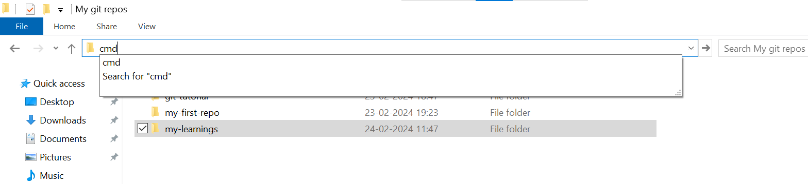

## step 1
- go to the repositary you want to clone in github

## step 2
- click on the green color button saying `code`

## step 3
- copy the link shown in the page

## step 4
- open the folder in the file explorer and type `cmd` in the address bar of the folder where you want to clone
- 

## step 5
- after opening cmd ,type `git clone` and paste the url copied

## step 6
- right click on the folder ,that you created by cloning and press `open with code` to open the folder in vs code

