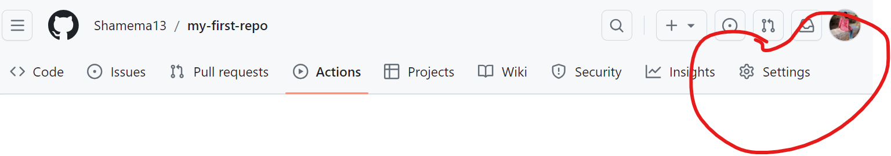
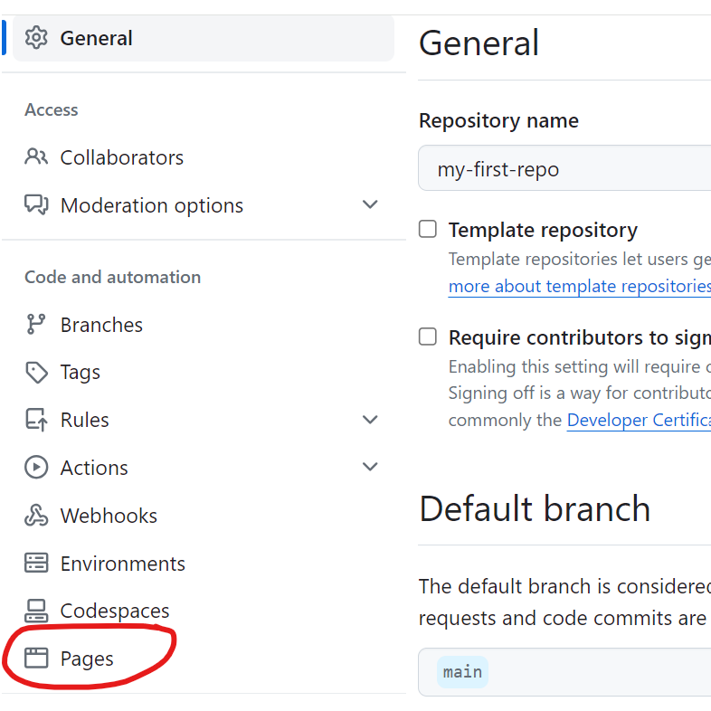
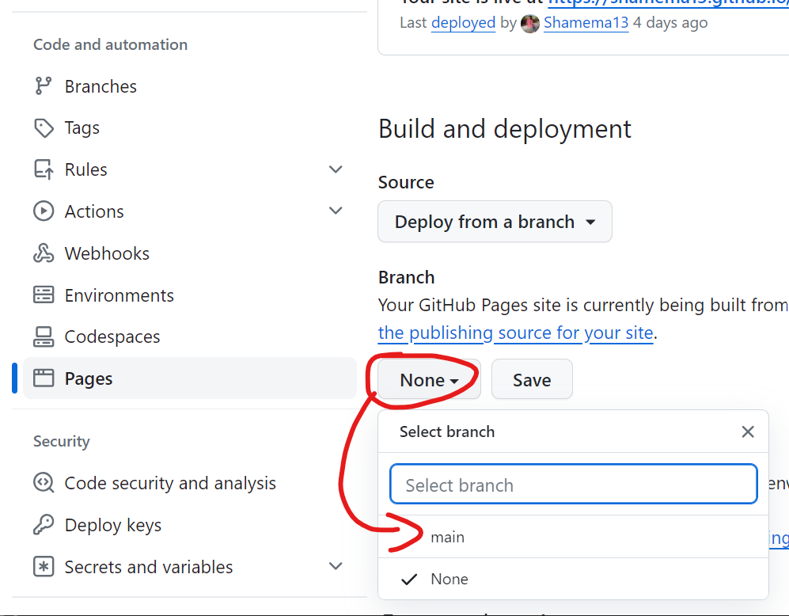
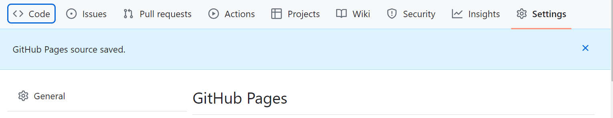
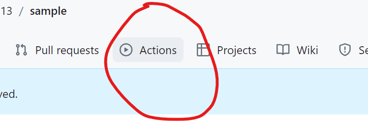
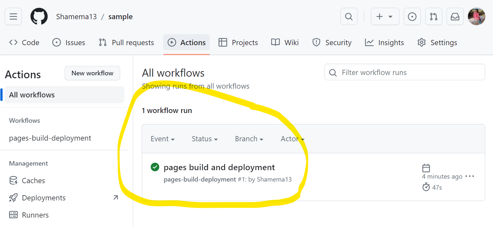
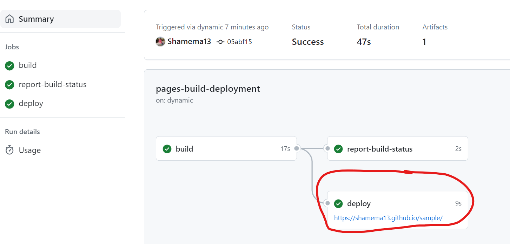

## step 1
- go to the repositary you want to deploy

## step 2
- click on settings on the right of the screen
-  

## step 3
- click on pages on the left side
- 

## step 4
- click on `none` and select `main`
- 
- click on `save`

## step 5
- 
- you will get above message

## step 6
- 
- click on  `actions`

## step 7
- 
- initially you have to wait until the icon changes green 
- and click on the highlighted area

## step 8
-  
- you will see the deploy link
- click on the link to open the deploy website in new tab
